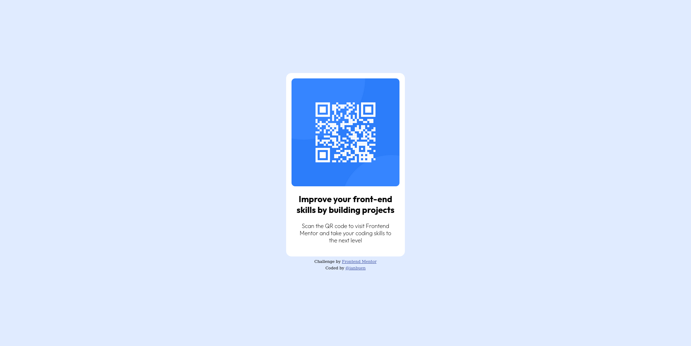

# Frontend Mentor - QR code component solution

This is a solution to the [QR code component challenge on Frontend Mentor](https://www.frontendmentor.io/challenges/qr-code-component-iux_sIO_H). Frontend Mentor challenges help you improve your coding skills by building realistic projects. 

## Table of contents

- [Overview](#overview)
  - [Screenshot](#screenshots)
  - [Links](#links)
- [My process](#my-process)
  - [Built with](#built-with)
  - [What I learned](#what-i-learned)
  - [Continued development](#continued-development)
  - [Useful resources](#useful-resources)
- [Author](#author) 

## Overview

### Screenshots

 

### Links

- Solution URL: [Add solution URL here](https://www.frontendmentor.io/solutions/qr-code-component-idZVTLeBlC)
- Live Site URL: [Add live site URL here](https://ianbuen.github.io/qr-code-component/)

## My process

### Built with

- Semantic HTML5 markup
- CSS custom properties
- Flexbox

### What I learned

Taking up this challenge helped me review my fundamentals on HTML and CSS. I found using flexbox effective enough to achieve the desired result.

### Continued development

My usual things to improve I forget some basic stuff such as how to import stuff (fonts via urls) every now and then, that I have to consult documentations.

### Useful resources

- [Resource 1](https://developers.google.com/fonts/docs/getting_started) - This gave me an example on using Google Fonts API 

## Author

- Github - [@ianbuen](https://github.com/ianbuen)
- Frontend Mentor - [@ianbuen](https://www.frontendmentor.io/profile/ianbuen) 
